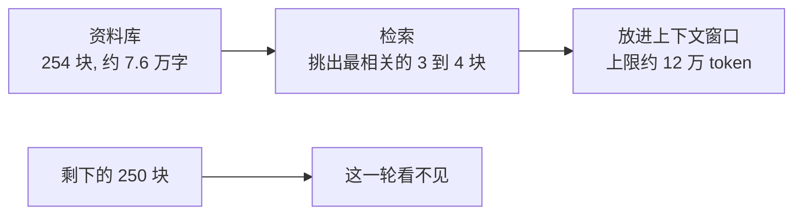

# 上下文窗口（模型一次能看见的字数上限）

**上下文窗口是模型一次能看见的字数上限。RAG 的做法是只把最相关的几段放进去，不是把全部资料一起塞。**

## Picture

## Analogy

开卷考试，只允许带一页 A4 纸进考场。你没法把整本书带进去，于是先查目录，挑出最相关的那一页抄下来。那张 A4 纸就是上下文窗口，RAG 就是考前查目录这一步。

## Where it fits

你 rag2 的五个步骤（读文件、切块、向量化、入库、检索）都从这一页纸的限制里长出来。它不是更高级的做法，是被逼出来的做法。

## 那为什么不直接全塞

你的资料约 7.6 万字，窗口约 12 万 token，看起来勉强装得下。但还有三条理由：

1. 钱：每次提问都按几万 token 计费，检索一次只花几千
2. 干扰：塞进去的内容越多，模型越容易被无关内容带偏
3. 会长大：今天 7.6 万字，加十篇笔记就 20 万字，窗口装不下了

## Baby steps

拿你自己的参数对一遍，两分钟：

1. 打开 `rag2/config.py`，找到 `DEFAULT_TOP_K`，看它是几
2. 跑 `python learn_rag\learn_4_store.py`，看它返回几块
3. 把这两件事对起来：top_k 就是"允许带进考场的那几页"

done 的样子：你能说出"我的系统每轮只带 4 块进去，剩下的 250 块留在库里"。

## Check yourself

1. 上下文窗口限制的到底是什么？

一次能处理的 token 总数，输入和输出都算在内。超了就被截断，前面的内容模型看不见。

2. 你的资料约 7.6 万字，窗口约 12 万 token，为什么不直接全塞？

三条：按 token 付费更贵、无关内容会干扰回答、资料还会继续长大。

3. 如果检索挑出来的那 3 块是错的，模型会怎样？

它会照着错的资料回答，而且答得很自信。所以检索命中率比回答的文笔重要得多。

## Go deeper

- 证据在你自己的语料里：`rag/notes/大模型入门.txt` 写着"处理约 12 万 Token 的输入。超过上限的内容会被截断。"
- 你的项目参数：`rag2/config.py` 里的 `DEFAULT_TOP_K`
- 下一课候选：向量检索是怎么算出"最相关"的

## Next lessons

- 向量检索的原理（相似度是怎么算出来的）
- 切块大小怎么选（300 字和 150 字差在哪）
