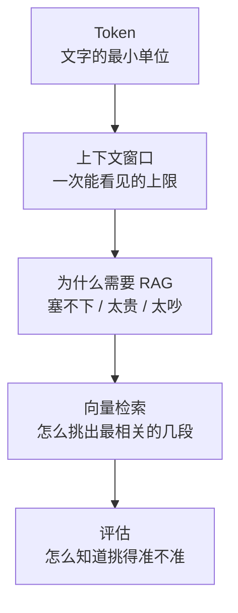

# 领域地图：LLM 基础

```mermaid
graph TD
  A[Token<br/>文字的最小单位] --> B[上下文窗口<br/>一次能看见的上限]
  B --> C[为什么需要 RAG<br/>塞不下 / 太贵 / 太吵]
  C --> D[向量检索<br/>怎么挑出最相关的几段]
  D --> E[评估<br/>怎么知道挑得准不准]
```

## 这个领域已经学过的课

1. [上下文窗口](../lessons/2026-09-19%20-%20context-window.md) — 为什么它是 RAG 存在的理由
