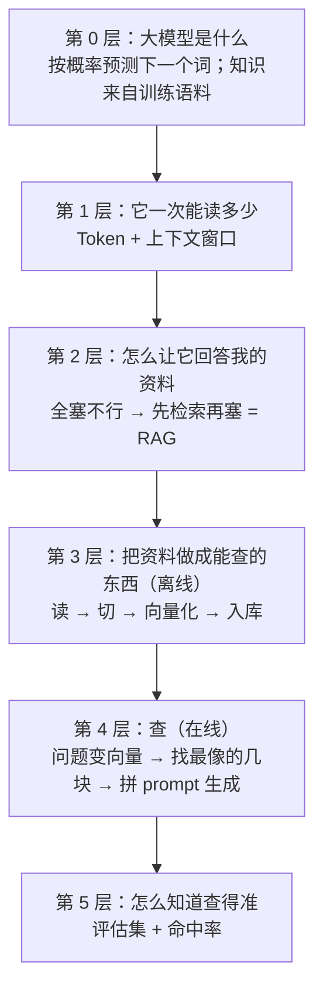

# 知识地图：从根到叶（RAG 全链）

这张图回答一个问题：**我学的每一个知识点，是在解决哪一层的问题。**

## 每一层要回答的问题

| 层 | 要回答的问题 | 对应你项目里的东西 | 状态 |
|---|---|---|---|
| 0 | 大模型到底在做什么？它为什么不知道我的资料？ | `qa.py` 里的系统提示词和 `build_prompt()` | 待讲 |
| 1 | 它一次能读多少字？超了会怎样？ | `rag/notes/大模型入门.txt` 里那句"约 12 万 Token" | 已讲（上下文窗口） |
| 2 | 既然塞不下，怎么让它回答我的资料？ | 整个 `rag2/` 存在的理由 | 待讲 |
| 3 | 怎么把资料做成能查的？（读、切、向量化、入库） | `loader.py` / `chunker.py` / `embedder.py` / `store.py` | 讲了一半（切块） |
| 4 | 提问之后机器里发生了什么？ | `retriever.py` / `bm25.py` / `reranker.py` / `qa.py` | 待讲 |
| 5 | 怎么知道检索准不准？ | `eval_rag2.py`（12 条评估集） | 待讲 |

## 用法

每次学一个新东西，先问自己：它在第几层？上一层的问题是什么？如果上一层答不上来，说明要先回去补那一层。
