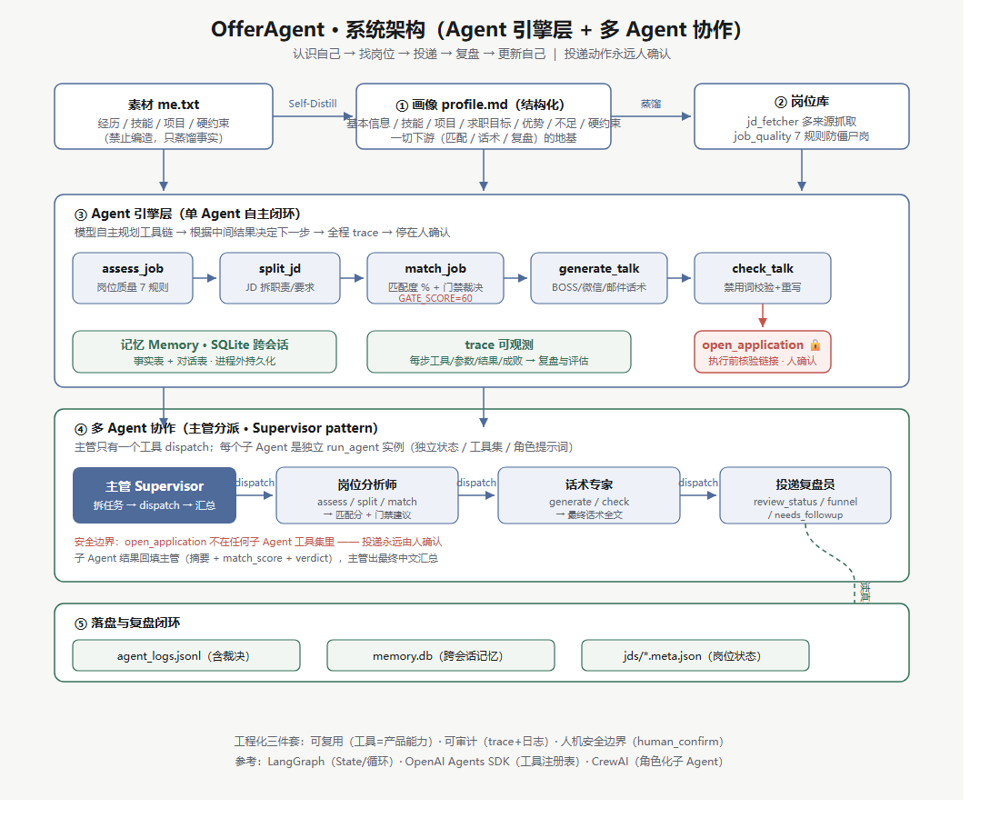

# 🎯 OfferAgent · 求职智能体

> 一个会"先认识自己、再找工作"的 AI 求职工作台：自我蒸馏 → 岗位匹配 → 投递话术 → 半自动投递 → 面试拷问 → 复盘进化。
> 附带**公开数字人名片页**：HR 知情访问，AI 分身用真实画像回答问题。
>
> 参考 srbhr/Resume-Matcher 的架构思路 + Liyaxuxu/icebreaker-hr 的话术经验，用 Streamlit 实现；核心差异化（自我蒸馏、数字分身、复盘闭环）为自研。

## 三个核心理念

1. **只挑不编**：所有生成内容只能来自你的真实素材，进行中的项目不许升级描述
2. **生成归工具，发送归人**：程序不替你发送任何消息（平台风控 + 诚信红线），最后一眼和最后一下由你完成
3. **有据可查**：每个界面都写清楚数据从哪来、算出来的分是什么意思

## 🤖 Agent 化引擎（2026-09 新增）

> 🎯 **批量打分排序**：`batch_score.py`（项目根）——分派「岗位分析师」子 Agent 对全部待投岗位评估质量 + 算匹配度，回填 `match_score/verdict` 到 meta.json，输出按匹配分从高到低的投递优先级（实测 9 岗：蔚蓝 86 > Calix 82 > 小米/南大/三和 78 > …）；Web 端「数据与日志」页也有「⚡ 批量打分」按钮。
>
> 📐 **架构图**：完整系统架构（画像地基 → 单 Agent 引擎 → 多 Agent 协作 → 落盘闭环）见 （SVG 源文件：docs/architecture.svg）。

把"人点按钮的应用"升级为**模型自主规划工具链的真 Agent**（`offer_agent_core.py` + `offer_agent_tools.py`）：

```
用户给一个目标 → 模型自主规划 → 依次调用工具 → 根据每个结果决定下一步 → 执行类动作停在人确认
```

- **工具注册表**：8 个工具统一 schema（assess_job / split_jd / match_job / generate_talk / check_talk / funnel / needs_followup / open_application🔒），全部复用本项目现有函数，不新造业务逻辑
- **状态对象 + ReAct 循环**：messages + 记忆 + trace + 预算上限（防死循环）
- **安全边界**：执行类动作（打开投递链接）标记 `human_confirm`，必须停在用户确认——"发送前那一下永远由人做"不变
- **可观测**：每步工具调用写入 trace，可导出复盘
- **实测**：`python agent_cli.py` 用真实岗位（Calix）跑通全链：质量评估 100 → JD 拆解 → 匹配 88% → 话术（禁用词 0）→ 校验 → 停在投递确认

> 命令行演示（项目根目录）：`python agent_cli.py --job <岗位>`（默认 calix）/ `--confirm`（模拟确认）
>
> **Web 端已接入**：主应用侧边栏「找工作 → Agent 流程（引擎演示）」——选岗位 → 一键跑完整工具链 → 看 trace → 确认投递。
>
> **Agent 化增强（2026-09 第二批）**：
> - **多岗位泛化**：已跑通 ant_agent（蚂蚁，match 78%）/ xiaomi_agent（小米，match 72%）/ calix（88%）；`--job <名>` 换岗即用
> - **链接失效检测**：open_application 执行前自动核验 URL——404/410 或无法访问 → 不打开、提示"不要投空"（实测：calix 占位链接 404 被拦，蚂蚁真实链接 200 放行）
> - **trace 落盘**：每次运行写入 `data/agent_logs.jsonl`（时间/岗位/公司/match_score/步数/是否确认/trace 全文），可复盘可统计
> - **Web 商业化升级（2026-09-29）**：Agent 页加岗位信息卡 + 投递日志表 + 「一键批量跑全部待投岗位」；数据页加「Agent 运行洞察」（匹配分分布图 + 运行记录）；默认主题切换为 D 精修浅色版
> - **引擎三升级（2026-09-29 第三批）**：
>   - **匹配分门禁**：`GATE_SCORE=60`——match_job 返回 `verdict`（建议投 / 不建议投），日志带裁决列，低于 60 分自动提示别投空
>   - **记忆落盘 SQLite**：`agent_memory.py` v2，`Memory(db_path=...)` 把事实/对话写入 `data/memory.db`，**跨会话记住用户**（无 db_path 保持纯内存，向后兼容）
>   - **多 Agent 协作**：`offer_agent_multi.py`——主管（Supervisor，唯一工具 dispatch）+ 子 Agent（岗位分析师：assess/split/match；话术专家：generate/check；**投递复盘员：funnel/needs_followup**，独立状态与角色提示词）；CLI `--multi` 跑通（Calix 匹配 82、门禁建议投、话术截断自动重派自纠错、复盘员漏斗分析端到端通过）；Web 批量处理跟随运行模式（单/多 Agent）；投递动作（open_application）不在子 Agent 工具集，永远人确认

## 核心功能

| 页面 | 功能 |
| --- | --- |
导航用 Streamlit 原生多页（`st.navigation`）：**每页有真实 URL**，可刷新、可前进后退、可分享链接；侧边栏按分区显示。一共 10 页——刻意不超过 10，因为 Streamlit 侧边栏超过 10 个就会把剩下的折叠成「View more」。

| 分区 | 页面（URL） | 干什么 |
| --- | --- | --- |
| 主线 | 今天（行动 + 数据）`/` | 待投清单逐条推进；第二个页签是漏斗 / 趋势 / 岗位排名 / 日报——**统计口径只有这一处** |
| 找工作 | 岗位库 `/jobs` · 匹配分析 `/match` · 简历 `/resume` · 投递台 `/apply` · 投递记录 `/records` | 一条链走完：多渠道搜岗 → 匹配 → 简历（内容 + 三套模板 + 照片 + ATS 覆盖检查）→ **唯一的话术生成入口**（批量 / 单条）→ 记录与跟进 |
| 我的 | 自我蒸馏 `/distill` · 面试准备 `/interview` | 画像 → 面试拷问 → 分身陪练 → 复盘写回画像（一个闭环，同页三个页签） |
| 对外 | 名片与分享 `/show` | 对外素材自检、公开名片链接（`?twin=1` 免密）、简历 PDF 导出 |
| 其它 | 设置 `/settings` | API Key / 模型（默认 flash）/ 每日投递目标 / 每日调用限额 / 访问密码 / 主题 |

**两条硬规则**：一个动作只有一个入口（话术只在「投递台」生成，其他地方是「跳过去并定位这条」，跨页跳转用 `st.switch_page`）；同一个数字只有一个出处（统计只在「今天 → 数据与日志」）。

## 亮点细节

- **自我蒸馏（Self-Distill）**：问答式 15 题把真实的你蒸馏成结构化画像 `profile.md`，之后所有环节都基于这份画像，不编造。
- **数字分身名片页**：`/?twin=1` 免密码访问。HR 点进链接即可：看基本盘 → 看项目证据（上线应用 / GitHub / 简历 PDF）→ 直接问分身问题。页面标注"AI 分身基于真实画像，最终以本人沟通为准"。
- **半自动批量投递台**：一键为全部待投岗位生成话术 → 逐条"复制 / 打开 / 保存修改 / 标记已投"。发送那一下永远留给人。
- **话术 v6**：BOSS 极简直接版（"你好，我是 XX 学校 XX 专业学生，2027 届，想投贵公司 XX 岗位，以下是我的简历"）+ 邮件/内推人话版；禁用词 45+ 自动拦截 AI 腔，生成后自动校验。
- **面试拷问**：按 JD 出题 → 逐题点评 → 总评与改进清单；复盘可写回画像，分身越用越准。
- **链接失效检测**：投递前自动重访岗位 URL，404/410 标记失效，避免投空。
- **L1 密码门**：密码 SHA-256 哈希存储（`data/config.json` 或 Secrets `APP_PASSWORD`）。
- **5 套主题**（含深色 Night）。

## 快速开始（本地）

```bash
cd offeragent
pip install -r requirements.txt

# 1) 准备素材：把自己的情况写进 me.txt（姓名/学校/技能/项目/求职目标/硬约束）
# 2) 配置密钥：复制 .streamlit/secrets.toml.example 为 secrets.toml，填入 DEEPSEEK_API_KEY
# 3) 启动
streamlit run offer_agent_app.py
```

打开 `http://localhost:8501` → 先到「我的资料 → 自我蒸馏」生成画像，再去「岗位」加 JD 或从 URL 导入。

## 部署上线（Streamlit Community Cloud）

1. 把 `offeragent` 目录推到 GitHub（`.gitignore` 已排除 `data/` 与 `.streamlit/secrets.toml`，隐私与密钥不泄露）
2. [share.streamlit.io](https://share.streamlit.io) → GitHub 登录 → New app
   - Repository 选你的仓库；**Main file path 填 `offeragent/offer_agent_app.py`**
3. Advanced settings → Secrets 填两项：

```toml
DEEPSEEK_API_KEY = "sk-你的key"
APP_PASSWORD = "给工作台设的访问密码"
```

4. Deploy → 2 分钟拿到公开链接
5. 数字名片页：公开链接后加 `/?twin=1`（免密码，供 HR 访问）

> 部署版是空数据开始（本地 `data/` 不上传）：首屏先用 me.txt 蒸馏画像，再导入岗位。设计如此——你的求职数据留在本机。

## 架构

```
offeragent/
├── offer_agent_app.py      # Streamlit 主应用（全部页面 + 公开名片页）
├── prompts.py              # 所有提示词集中管理（画像/匹配/建议/话术 v6 + 禁用词 45+）
├── digital_twin.py         # 数字分身（自我介绍/反问/扮演我/复盘/岗位雷达/画像进化）
├── distill*.py             # 自我蒸馏（问答式/填表式）
├── jd_fetcher.py           # JD 抓取（直连优先，r.jina.ai 兜底）
├── job_sources.py          # 岗位源（牛客/实习僧/BOSS，结构化解析 + 浏览器抓取）
├── job_quality.py          # 岗位质量检测
├── company_lookup.py       # 公司信息补全
├── resume_tailor.py        # ATS 简历覆盖检查
├── resume_builder.py       # 简历生成
├── interview_drill.py      # 面试拷问（出题/点评/总评）
├── pipeline.py             # 漏斗/跟进/被拒归因
├── v41.py                  # 增强：批量匹配/链接检测/漏斗图/面试提醒/密码哈希
├── apply_assist.py         # 投递辅助（复制/打开/记录；明确不做全自动）
├── theme.py                # 5 套主题
└── data/                   # 运行数据（本地，git 排除）
    ├── profile.md          # 蒸馏后的画像
    ├── jds/                # 岗位库（JD + meta）
    ├── match_results/      # 匹配报告
    ├── applications.jsonl  # 投递日志
    ├── reviews.jsonl       # 面试复盘
    └── talk_queue.json     # 批量话术队列
```

## 安全与隐私

- 密钥只存在本机 `data/config.json` 或部署 Secrets；`data/` 全目录 git 排除（含 BOSS 登录态 `edge_profile`）
- 密码 SHA-256 哈希，不存明文
- 数字分身只回答画像里的事实，提示词硬规则"没有就直说没有"，不编造
- 不做全自动投递、不做 AI 冒充本人面试（平台风控 + 身份诚信红线）

## 技术栈

Python · Streamlit · DeepSeek API · requests · plotly · pypdf · python-docx · 纯本地数据（无外部数据库）
